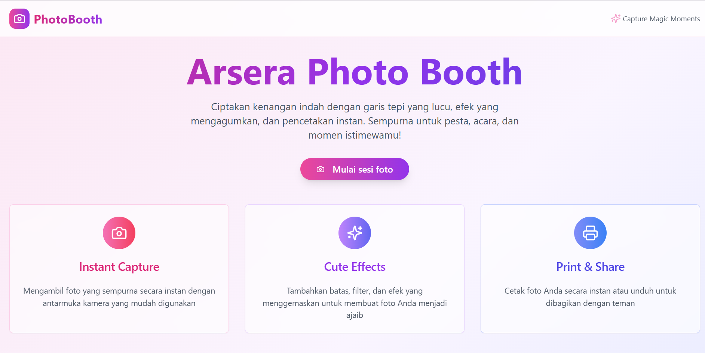
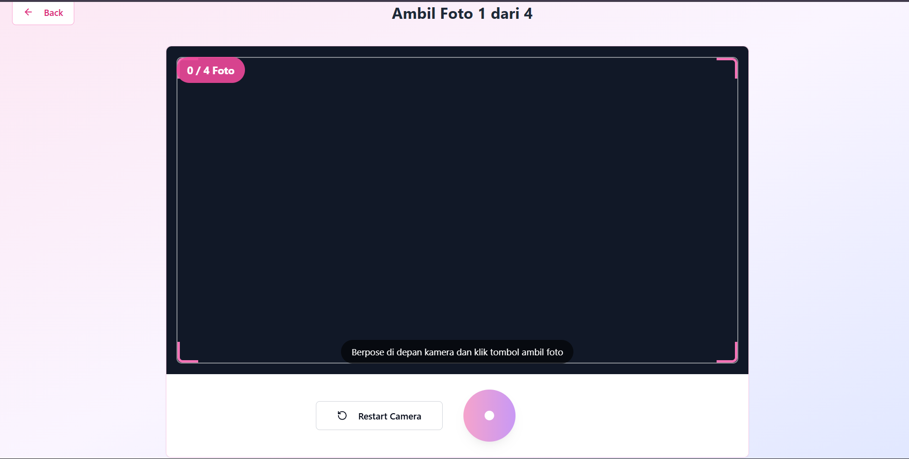
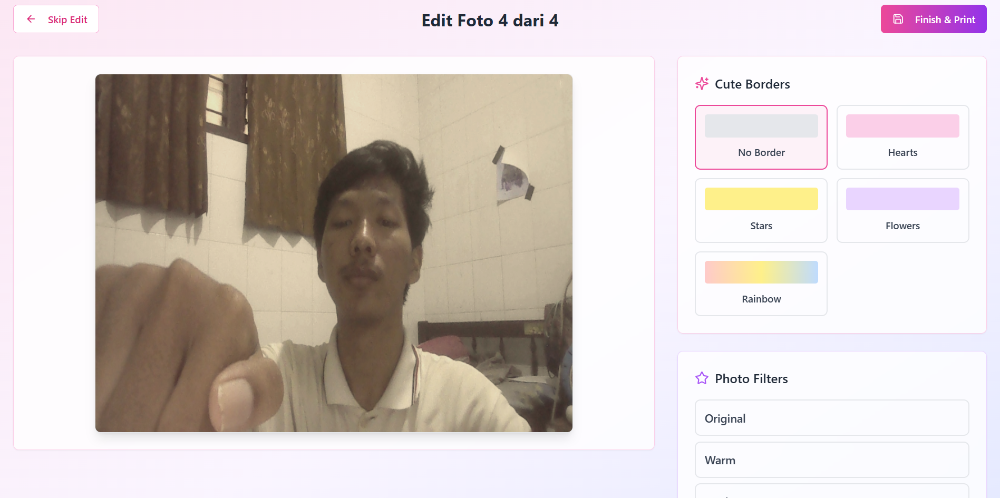

# Arsera Photo Booth

    

Sebuah aplikasi web photobooth interaktif yang memungkinkan pengguna untuk mengambil foto, menambahkan efek lucu, dan mencetak hasilnya secara instan. Dirancang khusus untuk acara-acara seperti pesta, ulang tahun, atau momen spesial lainnya.

## 🎯 Gambaran Singkat

Arsera Photo Booth adalah aplikasi web modern yang mengubah pengalaman mengambil foto menjadi sesuatu yang menyenangkan dan kreatif. Dengan antarmuka yang ramah pengguna, pengguna dapat:

- Mengambil foto secara real-time menggunakan kamera perangkat
- Menambahkan berbagai border lucu (hati, bintang, bunga, pelangi)
- Menerapkan filter foto yang menarik
- Mencetak foto dalam format strip klasik
- Mengunduh atau membagikan foto hasil edit

## ✨ Fitur Utama

### 📸 Capture Foto
- Akses kamera real-time dengan antarmuka yang intuitif
- Countdown timer sebelum pengambilan foto
- Frame overlay untuk memandu posisi pengguna
- Dukungan untuk kamera depan dan belakang

### 🎨 Editor Foto
- **Border Lucu**: Pilih dari berbagai border tematik
  - Hati merah muda
  - Bintang kuning
  - Bunga ungu
  - Pelangi warna-warni
- **Filter Foto**: Terapkan efek visual
  - Warm (hangat)
  - Cool (dingin)
  - Vintage (retro)
  - Bright (terang)

### 🖨️ Print & Share
- Preview layout cetak dengan format strip klasik
- Cetak langsung ke printer
- Unduh foto dalam format JPEG
- Copy ke clipboard untuk berbagi cepat
- Dukungan untuk berbagai ukuran cetak

## 🏗️ Struktur Folder Proyek

```
arsera-photobooth/
├── public/                    # Static assets
│   ├── favicon.ico
│   ├── placeholder.svg
│   └── robots.txt
├── src/
│   ├── components/           # Reusable UI components
│   │   ├── ui/              # Shadcn/UI components
│   │   ├── PhotoCapture.tsx # Camera capture component
│   │   ├── PhotoEditor.tsx  # Photo editing component
│   │   └── PrintPreview.tsx # Print preview component
│   ├── hooks/               # Custom React hooks
│   ├── lib/                 # Utility functions
│   ├── pages/               # Page components
│   │   ├── Index.tsx        # Main landing page
│   │   └── NotFound.tsx     # 404 page
│   ├── App.css              # Global styles
│   ├── App.tsx              # Main app component
│   ├── index.css            # Base styles
│   └── main.tsx             # App entry point
├── dist/                    # Build output (generated)
├── node_modules/            # Dependencies
├── index.html               # HTML template
├── package.json             # Project dependencies & scripts
├── tailwind.config.ts       # Tailwind CSS configuration
├── tsconfig.json            # TypeScript configuration
├── vite.config.ts           # Vite build configuration
└── README.md                # Project documentation
```

## 🛠️ Teknologi yang Digunakan

- **Frontend Framework**: React 18.3.1 dengan TypeScript
- **Build Tool**: Vite 5.4.1
- **Styling**: Tailwind CSS 3.4.11
- **UI Components**: Shadcn/UI (Radix UI primitives)
- **Icons**: Lucide React
- **State Management**: React Hooks
- **Routing**: React Router DOM
- **Form Handling**: React Hook Form dengan Zod validation
- **Charts**: Recharts (jika diperlukan)
- **Package Manager**: npm

## 📋 Prasyarat

Sebelum menjalankan proyek ini, pastikan Anda memiliki:

- Node.js versi 16 atau lebih tinggi
- npm atau yarn
- Browser modern dengan dukungan WebRTC (untuk akses kamera)
- Printer (opsional, untuk fitur cetak)

## IDE Editor Lovable
- **URL**: https://lovable.dev/projects/6ddfc57a-16e8-4e1b-8482-af137fb90b63


## 🚀 Cara Setup Local

### 1. Clone Repository

```bash
git clone <YOUR_GIT_URL>
cd arsera-photobooth
```

### 2. Install Dependencies

```bash
npm install
```

### 3. Jalankan Development Server

```bash
npm run dev
```

Aplikasi akan berjalan di `http://localhost:8080`

### 4. Build untuk Production

```bash
npm run build
```

### 5. Preview Build

```bash
npm run preview
```

## 🌐 Cara Deploy ke Netlify

### Opsi 1: Deploy via Git (Direkomendasikan)

1. **Push kode ke Git repository** (GitHub, GitLab, atau Bitbucket)

2. **Connect ke Netlify**:
   - Buka [Netlify](https://netlify.com)
   - Klik "New site from Git"
   - Pilih repository Anda
   - Konfigurasi build settings:
     - **Build command**: `npm run build`
     - **Publish directory**: `dist`

3. **Deploy**:
   - Netlify akan otomatis mendeteksi dan build proyek
   - Site akan tersedia di URL Netlify yang dihasilkan

### Opsi 2: Manual Deploy

1. **Build proyek lokal**:
   ```bash
   npm run build
   ```

2. **Upload folder `dist`**:
   - Drag and drop folder `dist` ke Netlify Sites
   - Atau gunakan Netlify CLI:
     ```bash
     npm install -g netlify-cli
     netlify deploy --prod --dir=dist
     ```

### Konfigurasi Netlify (Opsional)

Tambahkan file `netlify.toml` di root proyek untuk konfigurasi khusus:

```toml
[build]
  command = "npm run build"
  publish = "dist"

[[redirects]]
  from = "/*"
  to = "/index.html"
  status = 200
```

## 📸 Dokumentasi & Screenshots




## 🤝 Cara Berkontribusi

Kami sangat menghargai kontribusi dari komunitas! Berikut adalah cara untuk berkontribusi:

### 1. Fork Repository

Klik tombol "Fork" di GitHub untuk membuat salinan repository ke akun Anda.

### 2. Clone Fork

```bash
git clone https://github.com/YOUR_USERNAME/arsera-photobooth.git
cd arsera-photobooth
```

### 3. Buat Branch Fitur

```bash
git checkout -b feature/nama-fitur-anda
```

### 4. Install Dependencies

```bash
npm install
```

### 5. Lakukan Perubahan

- Pastikan kode mengikuti standar proyek
- Tambahkan komentar yang jelas
- Test perubahan Anda

### 6. Commit Perubahan

```bash
git add .
git commit -m "feat: tambahkan fitur baru"
```

### 7. Push ke Branch

```bash
git push origin feature/nama-fitur-anda
```

### 8. Buat Pull Request

- Buka repository asli di GitHub
- Klik "Pull Request"
- Pilih branch Anda
- Isi deskripsi yang jelas tentang perubahan

### Panduan Kontribusi

- **Bug Reports**: Gunakan template issue yang tersedia
- **Feature Requests**: Diskusikan ide baru di Discussions
- **Code Style**: Ikuti ESLint configuration
- **Testing**: Pastikan tidak ada error linting
- **Documentation**: Update README jika diperlukan

## 📄 Lisensi

Proyek ini menggunakan lisensi MIT. Lihat file `LICENSE` untuk detail lebih lanjut.

## 👥 Kontak

- **Developer**: Arsera Team
- **Email**: contact@arsera.dev
- **Website**: [https://arsera.dev](https://arsera.dev)
- **GitHub**: [https://github.com/arsera](https://github.com/arsera)

## 🙏 Acknowledgments

- Terima kasih kepada [Lovable](https://lovable.dev) untuk platform development
- Icons dari [Lucide React](https://lucide.dev)
- UI Components dari [Shadcn/UI](https://ui.shadcn.com)
- Font dan styling dari [Tailwind CSS](https://tailwindcss.com)

---

**Copyright 2025 Arsera Team**
